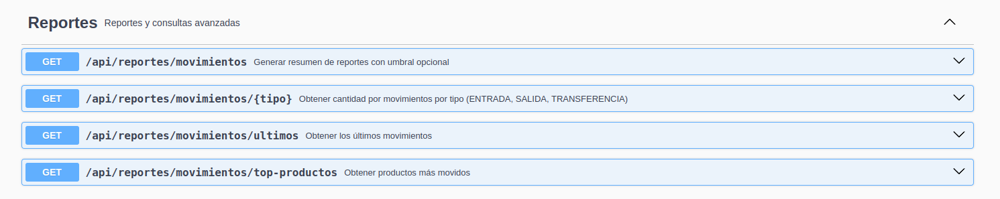
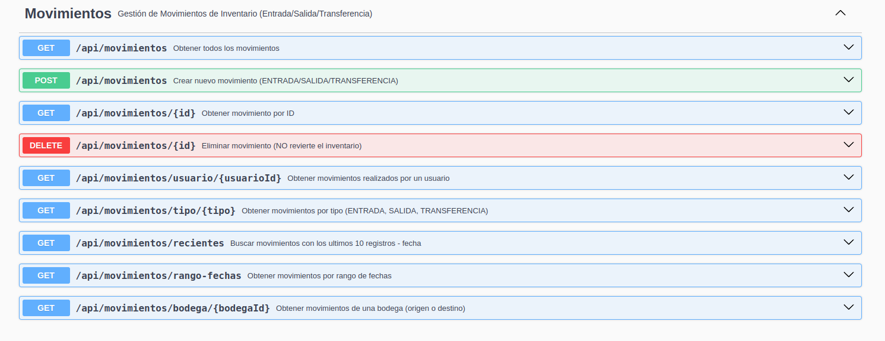

se creo endpoints videncia de reportes

swagger:  http://localhost:8081/swagger-ui/index.html#/

endpoint llamado ("/reportes/movimientos")

evidencia de movimientos swagger

endpoint llamado ("/movimientos/recientes")

